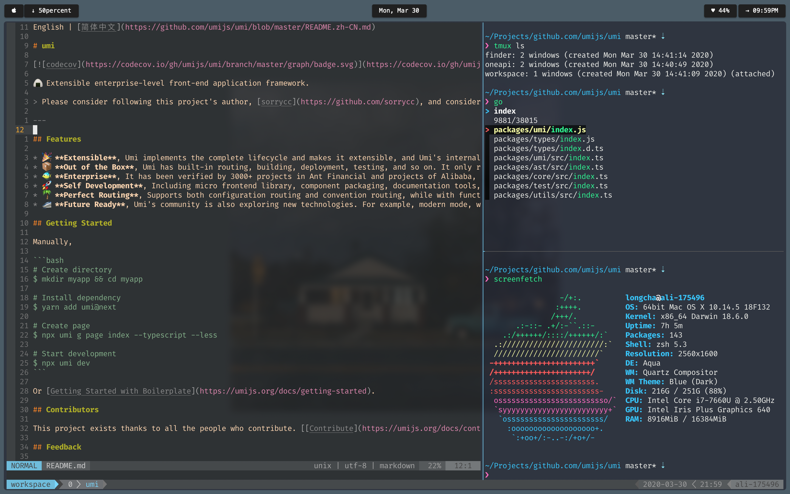

# dotfiles

### Screenshot



Obviously this setup works for me, a JavaScript developer on macOS, but this particular setup may not work for you. If this particular setup doesn't work for you, please steal ideas from this and if you like, contribute back tips, tricks, and other tidbits via Pull Requests if you like!


### Contents

+ [Vim/Neovim Setup](#vim-and-neovim-setup)
+ [Tmux Setup](#tmux-setup)
+ [ZSH Setup](#zsh-setup)


### Vim and Neovim Setup
Here I list some of my favorite plugins and settings. For more information you can go checkout my [.vimrc](https://github.com/focus7eleven/dotfiles/blob/master/nvim/.vimrc)

**Plugins:**

- [tpope/vim-surround](https://github.com/tpope/vim-surround): You can't miss this. (tpope is probably the most dope vim plugin artist)
- [christoomey/vim-tmux-navigator](https://github.com/christoomey/vim-tmux-navigator): Seemlessly switch between vim panes and tmux panes.
- [junegunn/fzf.vim](https://github.com/junegunn/fzf.vim): The best fuzzy finder plugin in my opinion.
- [airblade/vim-gitgutter](https://github.com/airblade/vim-gitgutter): An awesome plugin to show diff status on the signcolumn of vim.
- [itchyny/lightline.vim](https://github.com/itchyny/lightline.vim): Elegant and pure stausline.

**Settings:**

```
" seemlessly move between vim panes and tmux panes
inoremap <C-h> <Left>
inoremap <C-j> <Down>
inoremap <C-k> <Up>
inoremap <C-l> <Right>
cnoremap <C-h> <Left>
cnoremap <C-j> <Down>
cnoremap <C-k> <Up>
cnoremap <C-l> <Right>

" line text objects
xnoremap il g_o^
onoremap il :<C-u>normal vil<CR>
xnoremap al $o0
onoremap al :<C-u>normal val<CR>

" buffer text objects
xnoremap i% :<C-u>let z = @/\|1;/^./kz<CR>G??<CR>:let @/ = z<CR>V'z
onoremap i% :<C-u>normal vi%<CR>
xnoremap a% GoggV
onoremap a% :<C-u>normal va%<CR>


" Change text without putting the text into register,
nnoremap c "_c
nnoremap cc "_cc

```

### Tmux Setup

**Why I still need a terminal multiplexer as I can have multiple panes in iTerm2**

Tmux is great, especially when it is used with tmux. You can do a lot more things which iTerm2 does not support. I recommend [this video](https://www.youtube.com/watch?v=5r6yzFEXajQ) for you to check out more.

**How to generate the same style statusline for both tmux and vim?**

Check out this plugin: [edkolev/tmuxline.vim](https://github.com/edkolev/tmuxline.vim)

### ZSH Setup
My prompt choice: [pure](https://github.com/sindresorhus/pure)
